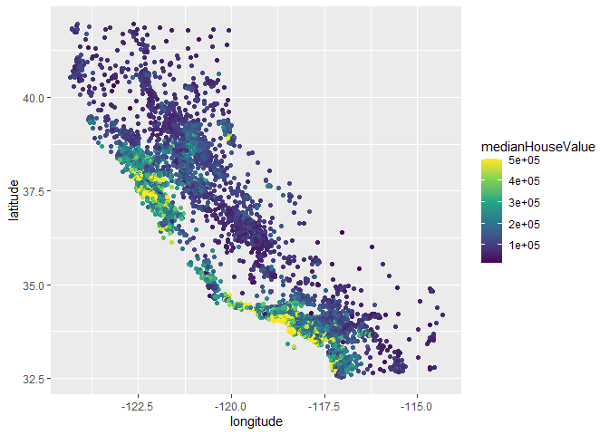
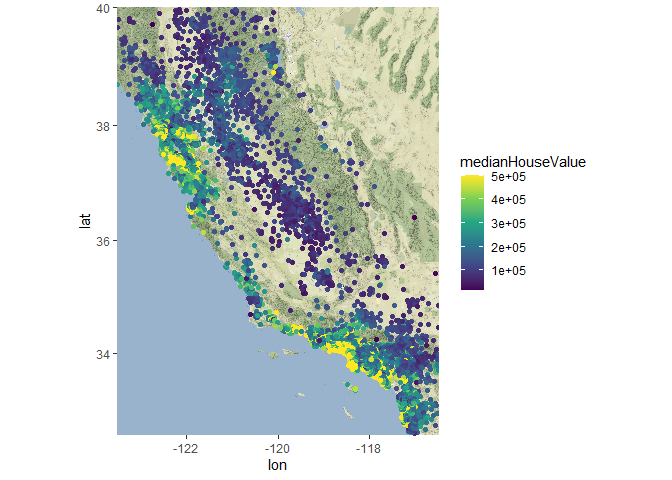
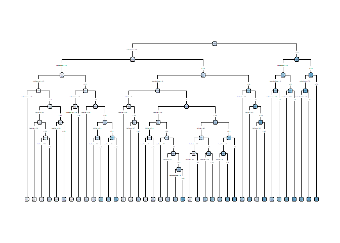
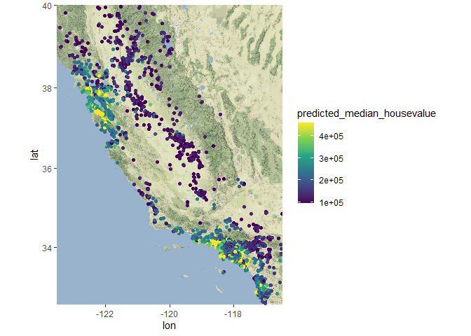
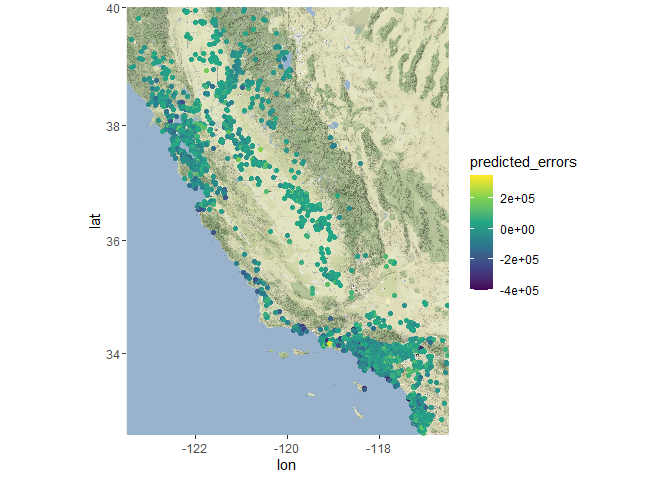

DataMining\_HW3
================
Wen-Hsin Chang
2021/3/15

**Q1. What Causes what?**

*1. Why can’t we just get data and run the regression of “Crime” on
“Police”?* We can’t run the regression of Crime on Police because of the
endogeneity problem. For instance, high-crime cities may have an
inherently higher incentive to have more police, which causes a reverse
causality. Moreover, there may be some unobservables such as the city’s
financial distress that is correlated with the number of police stations
but also correlated with the city’s crime rate, which is an omitted
variable problem.

*2. How were the researchers from UPenn able to isolate this effect?
Briefly explain Table2* The researchers take advantage of High terrorism
alert day, an incident that increases the deployment of police for
reasons unrelated to the city’s crime. The result in Table2 shows that
high alert day is negatively and significantly related to the daily
number of crimes.

*3. Why did they control Metro ridership? What was that trying to
capture?* The authors control Metro ridership because they want to make
sure that the result is not driven by the fact that there are fewer
pedestrians and therefore fewer victims on the street due to the high
alert. In this case, the author can capture the pure effect of the
increasing police on the crime rate, holding the number of potential
victims fixed.

*4. Can you describe the model in Table 4 column 1? What is the
conclusion?* Table 4 column 1 shows that for firms in district 1, the
negative effect of high alert day on the number of crimes is
significantly larger relative to firms in other districts.

**Q2.Predictive model building:green certification**

To build a model that allows me to quantify the average change in rental
income associated with green certification, I decide to apply the
forward stepwise procedure.

The stepwise selection result shows that the regression of revenue on (
City\_Market\_Rent + size + class\_a + class\_b + amenities +
hd\_total07 + Electricity\_Costs + Energystar + net + age + Gas\_Costs +
LEED + empl\_gr) attains the lowest AIC value.

    ## [1] "RMSE of base model: 10.145784"

    ## [1] "RMSE of stepwise model: 9.980714"

Compared with the RMS of baseline model, which include only the most
intuitive figures such as market rent, size, rent, the stepwise model
does a better job in the testing data set.

*What’s the average change in rental associated with green
certification?* I think the most intuitive way is to use the regression
coefficients according to my forward stepwise model. The above result
shows that on average, LEED certification will increase the revenue per
square foot by 2.95, whereas the Energystar certification will increase
the revenues per square foot by 1.624.

    ## 
    ## Call:
    ## lm(formula = revenue ~ City_Market_Rent + size + class_a + class_b + 
    ##     amenities + hd_total07 + Electricity_Costs + Energystar + 
    ##     net + age + Gas_Costs + LEED + empl_gr, data = Greenbuilding_train)
    ## 
    ## Coefficients:
    ##       (Intercept)   City_Market_Rent               size            class_a  
    ##        -1.484e+01          9.886e-01          7.437e-06          4.555e+00  
    ##           class_b          amenities         hd_total07  Electricity_Costs  
    ##         2.596e+00          1.564e+00          7.851e-04          1.809e+02  
    ##        Energystar                net                age          Gas_Costs  
    ##         1.626e+00         -2.381e+00         -1.237e-02         -1.457e+02  
    ##              LEED            empl_gr  
    ##         2.980e+00          1.898e-02

**Q3:Predictive model building:California housing**

**plot A: Using color scale to show medianHouseValue versus longitude(x)
and latitude(y)**

<!-- -->

From the raw result (before adding the actual plot), we can tell that
the median house value is higher when we move toward the lower left. In
terms of geography, it should be the houses near the pacific ocean.

<!-- -->

After adding an actual map of California as background, we once again
confirm that houses with higher values are the ones that are near the
coast. The further from the coast, the lower the house price.

**plot B: model prediction of medianHouseValue versus longitude(x) and
latitude(y)** I use the tree model to predict the medianHouseValue.
First of all, I fit the tree model and graph it to get a better sense of
the data.

<!-- -->

<!-- -->

Consistent with our expectation, the tree model predicts that high house
value is associated with the distance to the coast. However, the result
above also shows that somewhere near LA and San Francisco would have
higher house prices.

**Plot c: model errors versus longitude(x) and latitude(y)**

<!-- -->

    ## [1] "Out-of-sample error rate of my tree model: 0.004937"

Overall, the tree model that I choose is quite accurate given that the
error rate is close to zero. Alternatively, the out-of-sample accuracy
is around 0.9 in the out-of-sample forecast. However, for places near
LA, there is some evidence suggesting that the prediction from the tree
model tends to overprice.
